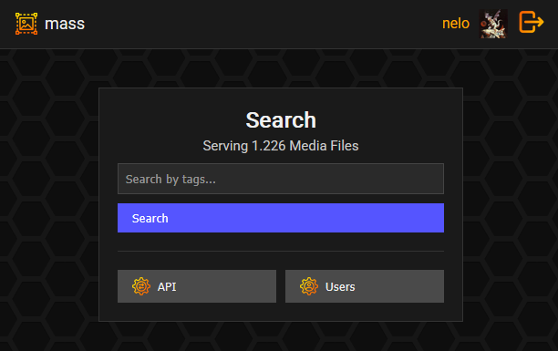

# M.A.S.S (Managed Archival Storage Server)
## 🕶️ Overview
With this project you can archive and browse public available media along with its metadata, including multiple tags and title. It gets stored in an optimized SQLite3 database that could handle 1.000.000+ media.

## 📋 Features
- `Login System`: The Webserver has a routing table that introduces a simple login and role system. The first register is the owner while all others are visitors or moderators that need to be approved by a moderator or admin to get access to the archival server. Admins can alter roles in the **/management**. 
- `API`: a simple API Key system, where admins can create and destroy API keys for upload (for now)
- `SQLite3 Database`: Simple but fast database used with optimizations enabled (cache, memory map, indexes, etc.). Enabled easy backup and migration since all data is in one file.
- `Microhttpd WebServer`: Very fast and lite webserver, originally for embedded serves as a good foundation.
- `C`: The complete project is written in C. Memory leaks should be not existant. Optimization flags like **-Ofast** are enabled in build files.
- `Advanced Search`: The search system can search for multiple tags (with tag autorecommendation based on occurence count), by title (or parts of it), sort by **score**, **mediaID** or **webID** and order by **ASC** or **DESC**.
- `Type Support`: Many media type are supported: **png**, **jpg**, **gif**, **txt** (good reader), **pdf**, **webm** and much more.
- `SSL Support`: SSL keys and crt can be added for encryption

## ⬇️ Installation
- Clone the repository
- Following libraries are needed: **jansson.h**, **libmicrohttpd**, **sqlite3**, **curl**
- Build the program with **build.sh** or **build.bat**
- run the program: **./mass**.

## ⚙️ Configuration
A configuration file automatically in the executable directory **mass.cfg**. Following options can be set:
- Server port
- SSL key path (optional)
- SSL certificate path (optional)
- Database file-path (should be placed onto a fast storage medium, e.g. `ssd`, `nvme`):
-  Size of database cache in MegaByte (greatly improves speed on large archives):
- Server Name
- Server Icon (must be placed in folder public/resources)
- Download Threads (concurrent media download count)
- Max Download Queue Count (max elements pending in download queue)
- Profile picture path
- Max Profile Image Size (in kB)
- New users require approval
- Media Folder
- Preview Folder (should be placed onto a fast storage medium, e.g. `ssd`, `nvme`)
- Description Folder

## API
- With a **POST Request** to /upload a media can be uploaded to the archive server. An API Key is needed for that. And example request could look like this:

```json
{
    "api_key": "RIHhttzPilZ",
    "dl_url": "https://example.com/media/example-picture.jpg",
    "preview_url": "https://example.com/preview/example-preview.jpg",
    "description": "<p>This is a sample media description.</p>",
    "web_id": 56180021,
    "title": "Example upload",
    "creator": "example-creator",
    "score": 1000,
    "tags": ["landscape", "forest", "sky", "sun"]
}
```